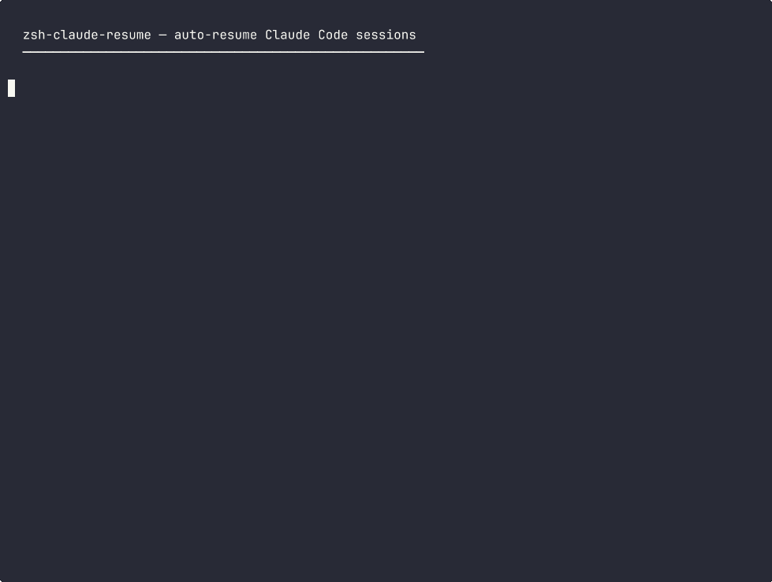

# zsh-claude-resume

A ZSH plugin that automatically suggests resuming your last [Claude Code](https://docs.anthropic.com/en/docs/claude-code) session. Type `claude` and instantly get back to where you left off.

## Demo



## The Problem

Every time you exit Claude Code and want to continue, you need to:

1. Run `claude --resume` and scroll through a picker
2. Or find the session ID manually and type `claude --resume <uuid>`

This gets tedious when you're jumping between projects.

## The Solution

This plugin does two things:

**Ghost text autosuggestion** — Type `claude` and your last session appears as greyed-out text. Press `->` to accept.

```
$ claude --dangerously-skip-permissions --resume 7cd08aff-eaf9-40c7-b48f-0e80c77c8334
  ^^^^^^^^^^^^^^^^^^^^^^^^^^^^^^^^^^^^^^^^^^^^^^^^^^^^^^^^^^^^^^^^^^^^^^^^^^^^^^^^^^^
  ghost text — press right arrow to accept
```

**Tab completion** — Type `claude --resume ` then `TAB` to browse sessions with summaries.

```
$ claude --resume <TAB>
efd4cdb1-...  XPM KVDT CON file submission (9w, feat/confile)
eb678a43-...  Test Fixes: Concurrency, Age Calc (10w, fix/ts-err)
f7d64f12-...  Update SDKV type & fix TypeScript errors (10w, fix/ts-err)
```

## Features

- **Per-directory sessions** — suggests the last session for your current project, not globally
- **Auto-detects your flags** — if you always use `--dangerously-skip-permissions`, the suggestion includes it
- **Zero dependencies** — pure ZSH + standard POSIX tools (no jq, no python)
- **Fast** — caches lookups with a 5-second TTL, no lag on keystrokes
- **Both storage formats** — works with old (directory) and new (JSONL) Claude Code session layouts

## Requirements

- [Oh My Zsh](https://ohmyz.sh/)
- [zsh-autosuggestions](https://github.com/zsh-users/zsh-autosuggestions) (for ghost text)

## Installation

### Oh My Zsh

1. Clone into your custom plugins directory:

```bash
git clone https://github.com/cuongtranba/zsh-claude-resume.git \
  ${ZSH_CUSTOM:-~/.oh-my-zsh/custom}/plugins/zsh-claude-resume
```

2. Add to your plugins list in `~/.zshrc` (**after** `zsh-autosuggestions`):

```zsh
plugins=(
  git
  zsh-autosuggestions
  zsh-claude-resume   # must come after zsh-autosuggestions
)
```

3. Reload your shell:

```bash
source ~/.zshrc
```

### Manual

1. Clone the repo:

```bash
git clone https://github.com/cuongtranba/zsh-claude-resume.git
```

2. Source the plugin in your `~/.zshrc`:

```zsh
source /path/to/zsh-claude-resume/zsh-claude-resume.plugin.zsh
```

## Configuration

All settings are optional with sensible defaults. Add to `~/.zshrc` **before** the plugins line:

```zsh
# Max sessions shown in tab completion (default: 10)
ZSH_CLAUDE_RESUME_MAX_SESSIONS=10

# Cache TTL in seconds (default: 5)
ZSH_CLAUDE_RESUME_CACHE_TTL=5

# Auto-detect common flags from history (default: true)
ZSH_CLAUDE_RESUME_AUTO_FLAGS=true
```

## How It Works

1. **Session lookup** — reads Claude Code's session data from `~/.claude/projects/<dir>/` (JSONL files or directories, sorted by modification time). Falls back to PID session files in `~/.claude/sessions/`.

2. **Flag detection** — scans your ZSH history for the most common `claude` invocation pattern and prepends those flags to the suggestion.

3. **Autosuggestion strategy** — registers a custom `claude_resume` strategy with zsh-autosuggestions, prepended before the default `history` strategy. Only activates when input starts with `claude`.

4. **Tab completion** — parses `sessions-index.json` with `awk` to display session ID, summary, time ago, and git branch.

## License

MIT
